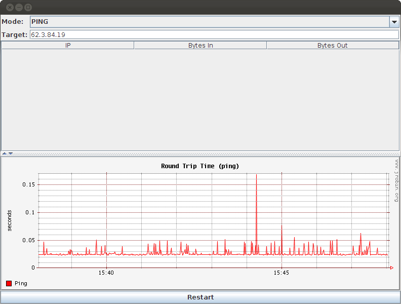

# Aptivate NetGraph

This application has two modes:

* Listening for Netflow traffic, listing flows and graphing them against each other;
* Pinging a server or router, and graphing the ping time

Both are intended as tools for network debugging. Certainly the user interface could
be simpler; but the graphical display is an important component in rapidly understanding
network conditions:

## Running

NetGraph is supplied with an executable JAR file that should work "out of the box":

	java -jar target/netgraph-120312-jar-with-dependencies.jar

Unlike on Windows, Java processes on Unix don't usually have enough
privilege to send ICMP echo-request (ping) packets:
http://bordet.blogspot.com/2006/07/icmp-and-inetaddressisreachable.html

Since many routers don't respond on the echo port, you may need to run
the JAR file as root in order to ping:

	sudo java -jar target/netgraph-120312-jar-with-dependencies.jar

When it's running, you can type a new IP address into the box at the top.

If it doesn't draw a red line of the ping times, and you see this output
in the console:

	Pinging at 1331567323204 returned NaN
	Pinging at 1331567324214 returned NaN
	Pinging at 1331567325216 returned NaN
	Pinging at 1331567326217 returned NaN

That means that it needs to be run as root.

## Building

If you want to modify the source or rebuild the JAR, use Maven:

	mvn

Which should rebuild `target/netgraph-120312-jar-with-dependencies.jar`.

